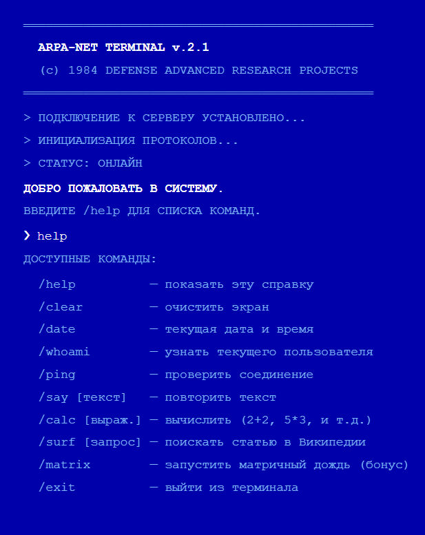

  

---

## **ARPA-NET Terminal v.2.1**

> *"Defense Advanced Research Projects Agency — Terminal Access Protocol"*

  
  
  
  

---

## **About The Project**

Welcome to **ARPA-NET Terminal** - a stylish retro terminal inspired by 80s aesthetics and hacker movies.

  

